# BusinessIntelligence.ai — Autonomous Decision Intelligence Copilot

**Team Scubacats | Accenture Innovation Challenge 2026**

> Most BI dashboards tell you *a number moved*. BusinessIntelligence.ai tells you **why it moved, how confident it is, and what to do next** — then gets better at that judgment every time an analyst uses it.

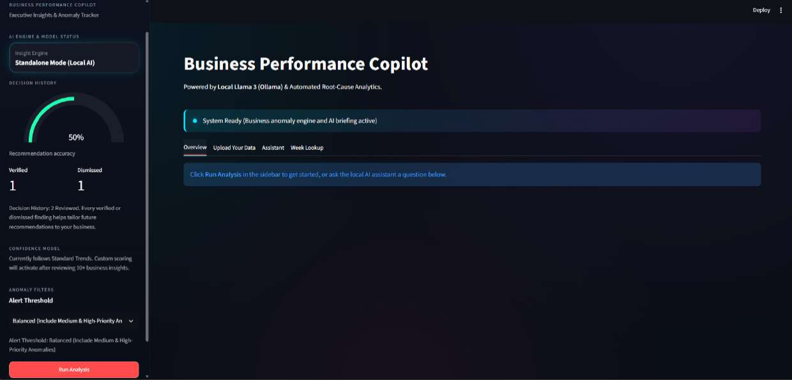

---

## Table of Contents
1. [Problem Statement](#1-problem-statement)
2. [Solution Overview](#2-solution-overview)
3. [How It Works in Practice (Walkthrough)](#3-how-it-works-in-practice-walkthrough)
4. [How AI Enables / Enhances the Solution](#4-how-ai-enables--enhances-the-solution)
5. [System Architecture](#5-system-architecture)
6. [Implementation Details](#6-implementation-details)
7. [Key Features](#7-key-features)
8. [Scalability](#8-scalability)
9. [Impact](#9-impact)
10. [Tech Stack](#10-tech-stack)
11. [Setup & Run](#11-setup--run)
12. [Known Limitations](#12-known-limitations)
13. [Roadmap](#13-roadmap)

---

## 1. Problem Statement

Business teams are drowning in dashboards that show *what* changed (revenue dipped, delivery times spiked) but leave the *why* to a human analyst who has to manually cross-reference support tickets, delivery logs, and calendars — a process that's slow, inconsistent, and rarely documented for reuse. Meanwhile, most "AI insight" tools either hallucinate causes with no evidence, or require heavyweight, cloud-only infrastructure that's a non-starter for cost-sensitive or data-sensitive teams.

## 2. Solution Overview

BusinessIntelligence.ai is an **autonomous decision-intelligence engine** that:

1. **Detects** statistically meaningful anomalies in any business metric using a robust median/MAD-based method.
2. **Classifies** each anomaly as a growth **opportunity** or a **risk**.
3. **Retrieves real evidence** (delivery records, customer feedback, calendar events) from the same time window.
4. **Generates candidate explanations** grounded in that evidence — never invented.
5. **Scores each hypothesis's confidence** based on how much evidence actually supports it.
6. **Learns from analyst feedback** (Confirm/Reject) — retraining a real classifier after every decision, so confidence scoring measurably improves over time.
7. **Forecasts** the metric forward with a confidence band.
8. **Chats** via a local Llama 3 model that is grounded in the pipeline's actual output — not a generic chatbot bolted on top.

It runs equally well in two modes:
- **Demo Mode** — a pre-loaded synthetic multi-region dataset with a baked-in anomaly, for quick evaluation.
- **Universal Mode** — upload your own CSV/Excel data (any date + numeric metric + optional category columns) and run the same statistical engine on it.

---

## 3. How It Works in Practice (Walkthrough)

### Step 1 — Run the pipeline
The analyst clicks **Run Analysis**. The engine scans every metric/region combination, flags statistically significant deviations, and surfaces the single highest-impact anomaly first.

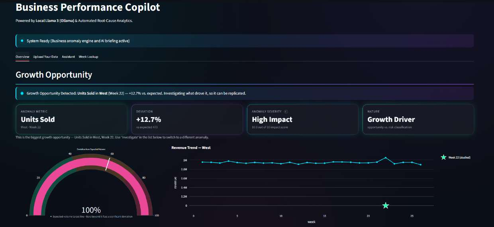

Here, **Units Sold in West (Week 22)** is flagged as a +12.7% deviation — a **Growth Opportunity** (High Impact, score 10/10) — with the exact revenue trend chart marking the anomalous week.

### Step 2 — Forecast the metric
Every anomaly view includes an on-demand forecast (Prophet-based, with a 95% confidence interval) so the analyst can see where the metric is headed, not just where it's been.

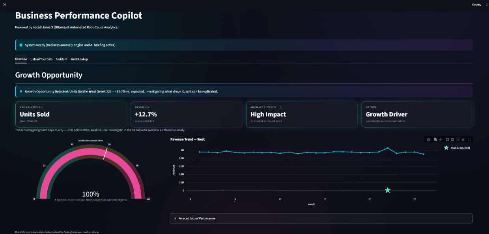

### Step 3 — AI generates hypotheses
Rather than guessing, the system proposes **time-correlated candidate explanations** built from real uploaded/demo evidence — labeled explicitly as correlation, not proven causation.

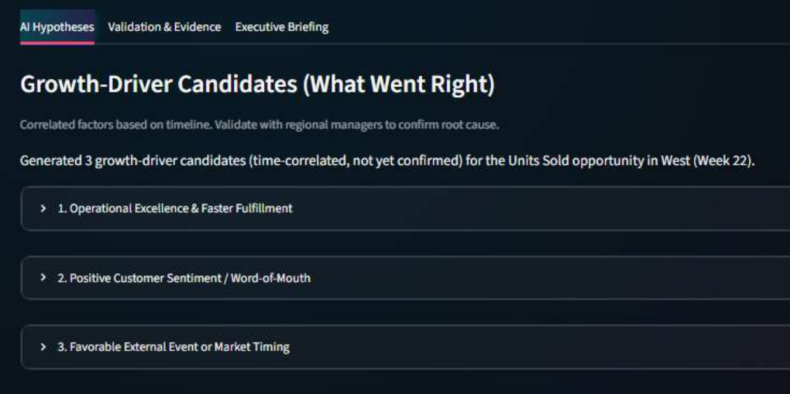

### Step 4 — Hypotheses are tested against evidence
Each hypothesis is scored against the actual evidence records it cites (delivery logs, feedback, events) and given a confidence label and percentage — fully auditable.

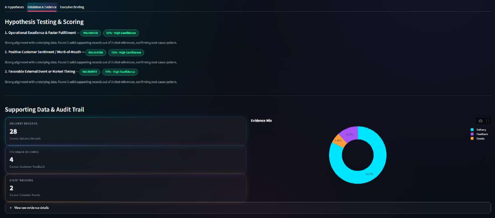

### Step 5 — Executive summary & action plan
The system synthesizes the strongest-supported hypothesis into a plain-English executive briefing with concrete next actions.

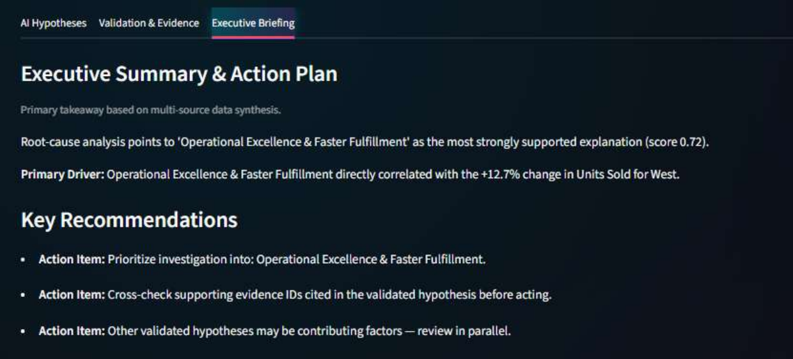

### The same flow runs for risks, not just opportunities
E.g. a **+118.6% spike in Avg Delivery Days in the North region** is caught, diagnosed against delivery/feedback evidence, and turned into an action plan (root cause: *Supply Chain Disruption & Late Deliveries*, score 0.71).

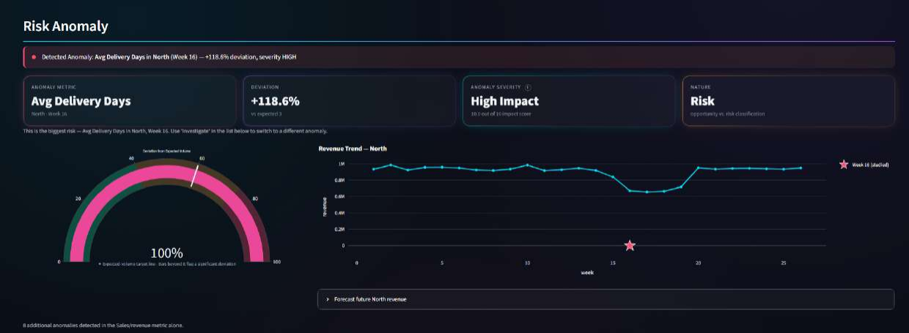
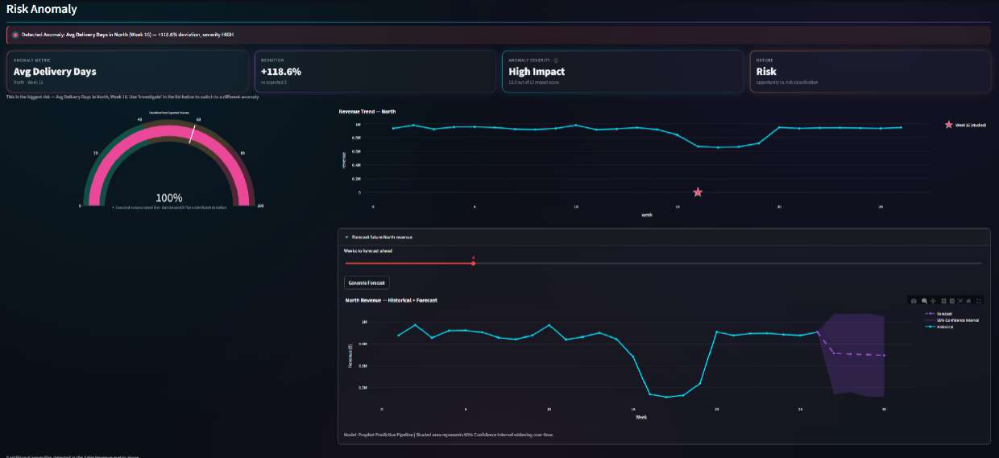
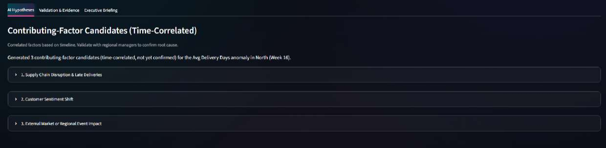
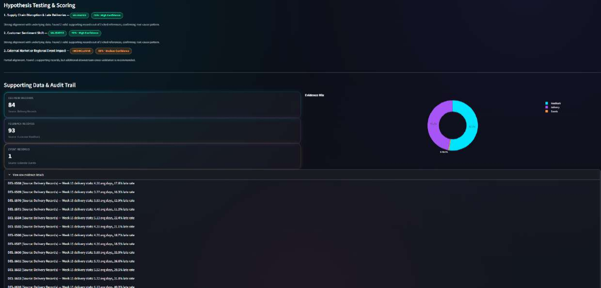
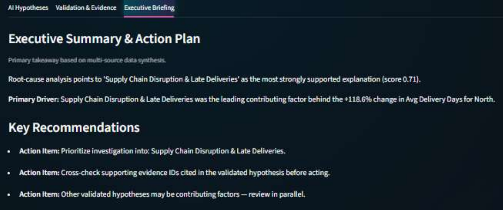

### Step 6 — Browse every anomaly at once
Analysts aren't limited to the top anomaly — every flagged opportunity and risk across every metric/region/week is listed and individually investigable, plus a ranked bar chart of every deviation's magnitude.

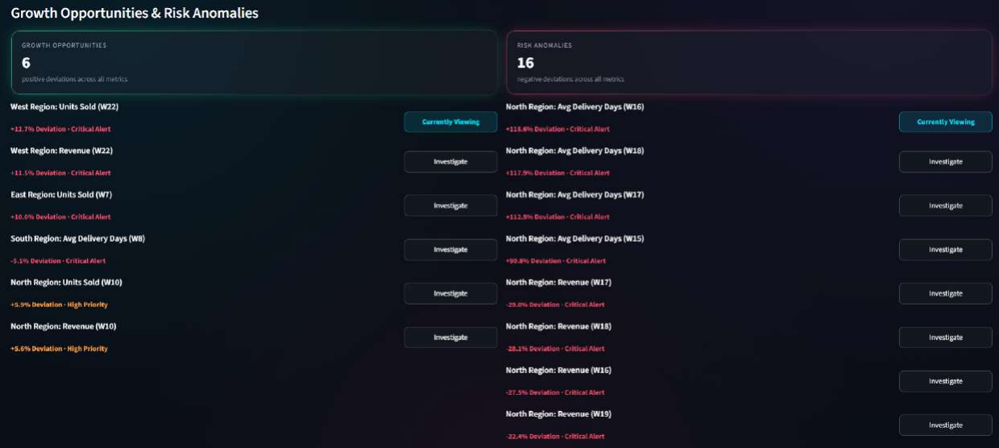
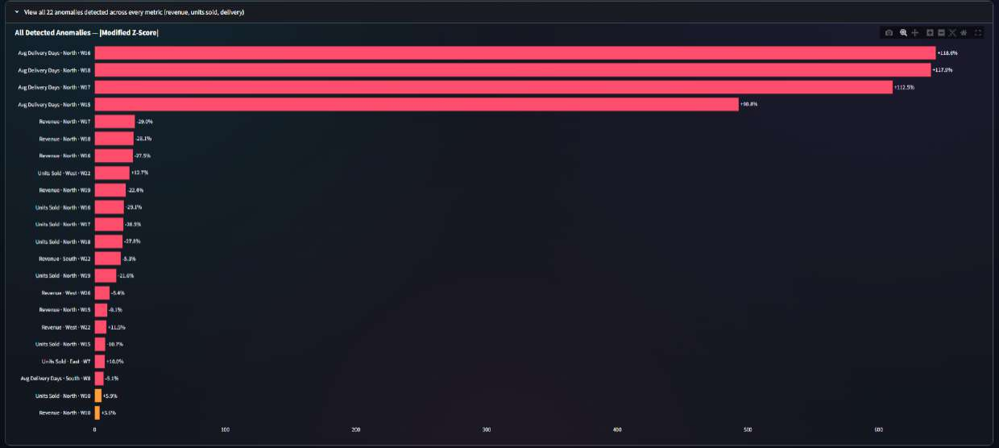

### Step 7 — Bring your own data
Any CSV/Excel file with a date column and a numeric metric can be dropped in — no schema migration, no code changes.

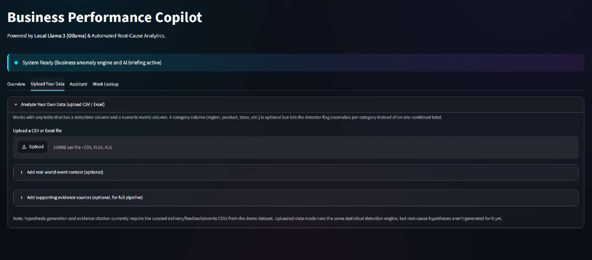

### Step 8 — Ask the copilot directly
A local, private LLM (Llama 3 via Ollama) answers free-form business questions, grounded only in the pipeline's real output — including suggested starter questions.

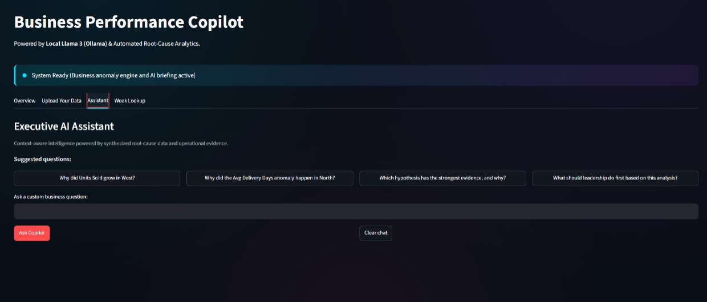

### Step 9 — Drill into any single week
For full transparency, any week's raw numbers across every region/metric can be looked up directly.

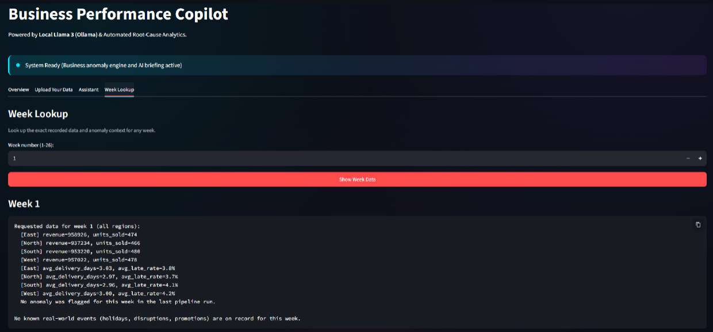

---

## 4. How AI Enables / Enhances the Solution

AI isn't cosmetic here — it does work that a static dashboard structurally cannot:

| Capability | Where AI is used | Why it matters |
|---|---|---|
| **Anomaly framing** | Statistical detection (median/MAD, modified z-score) feeds an AI reasoning layer that turns "a number moved" into "here's a ranked, classified list of what deserves attention" | Removes the manual scan-every-chart step |
| **Evidence-grounded hypothesis generation** | Candidate explanations are generated *from retrieved evidence*, not from a language model's imagination | Prevents hallucinated root causes — every claim cites a real record ID |
| **Self-learning confidence engine** | A two-tier system: a heuristic recalibration layer active from the first feedback, upgrading to a `LogisticRegression` classifier once ≥8 labeled decisions exist (retrained from scratch after every Confirm/Reject) | Confidence scores get **measurably more accurate with use** — the system literally learns the analyst's judgment over time, with zero manual retraining step |
| **Local LLM assistant (Llama 3 / Ollama)** | Grounded chat over the pipeline's actual output (hypotheses, evidence, events) | Lets non-technical stakeholders ask "why" in plain English, privately, with no data leaving the machine |
| **Forecasting** | Prophet-based trend + seasonality modeling with a graceful linear-trend fallback | Turns anomaly detection from purely reactive into forward-looking |
| **Executive report generation** | Optional Gemini-powered summarization, with a deterministic offline fallback | Produces decision-ready briefings automatically, with or without cloud AI access |

**Honesty by design:** every AI-generated claim is labeled with its actual epistemic status — "time-correlated, not yet confirmed," "Validated — High Confidence," "train accuracy, not held-out accuracy." This is a deliberate choice to make an explainable, auditable system rather than a black box that sounds confident about everything.

---

## 5. System Architecture

```
                         ┌─────────────────────────────┐
                         │        Streamlit UI          │
                         │           app.py             │
                         └───────────────┬───────────────┘
                                          │
            ┌─────────────────────────────┼─────────────────────────────┐
            │                              │                              │
   ┌────────▼─────────┐        ┌───────────▼───────────┐        ┌────────▼────────┐
   │   Demo Pipeline    │        │   Universal Pipeline   │        │  Local / Cloud   │
   │ data_processor.py  │        │  universal_pipeline.py │        │  AI Layer        │
   └────────┬─────────┘        └───────────┬───────────┘        │ (Ollama + Gemini)│
            │                              │                     └────────┬────────┘
            └──────────────┬───────────────┘                              │
                            ▼                                             │
                 ┌─────────────────────┐                                  │
                 │  Anomaly Detector    │  (median/MAD, modified z-score) │
                 │  anomaly_detector.py │                                 │
                 └──────────┬───────────┘                                 │
                            ▼                                             │
              ┌──────────────────────────┐                                │
              │   Evidence Retrieval      │  (evidence_retriever.py /     │
              │                            │   generic_evidence.py)       │
              └──────────────┬─────────────┘                              │
                              ▼                                           │
              ┌──────────────────────────┐                                │
              │  Hypothesis Generation     │ (hypothesis_generator.py /   │
              │                            │  generic_hypothesis.py)      │
              └──────────────┬─────────────┘                              │
                              ▼                                           │
              ┌──────────────────────────┐                                │
              │   Hypothesis Testing       │ (hypothesis_tester.py)       │
              │  (evidence-based scoring)  │                              │
              └──────────────┬─────────────┘                              │
                              ▼                                           │
       ┌──────────────────────────────────────┐                          │
       │   Self-Learning Confidence Engine       │                       │
       │  feedback_store.py  +  model_trainer.py │◄──────────────────────┘
       │  (heuristic Tier-1 + LogisticRegression │  Analyst Confirm/Reject
       │   Tier-2, retrains after every decision)│  feedback loop
       └──────────────────┬───────────────────┘
                           ▼
              ┌──────────────────────────┐
              │   Reporter / Executive     │  (reporter.py — Gemini or
              │   Summary + Forecasting    │   offline fallback; forecasting.py
              └──────────────────────────┘   — Prophet or linear fallback)
```

**Data flow in one sentence:** raw data → statistical anomaly detection → evidence retrieval (time-windowed) → grounded hypothesis generation → evidence-based scoring → analyst feedback → self-retraining confidence model → forecast + executive briefing + grounded chat.

---

## 6. Implementation Details

| File | Responsibility |
|---|---|
| `app.py` | Streamlit dashboard — all UI, orchestrates every module below |
| `ai/data_processor.py` | Loads & weekly-aggregates the demo dataset |
| `ai/anomaly_detector.py` | Core stats engine — MAD/modified-z-score detection + opportunity/risk classification |
| `ai/evidence_retriever.py` | Pulls raw evidence rows (demo dataset) by anomaly time window |
| `ai/hypothesis_generator.py` | Fixed-template hypothesis generation for the demo's business story |
| `ai/universal_pipeline.py` | Ingests **any** uploaded file into the detector's expected shape |
| `ai/generic_evidence.py` | Evidence retrieval from user-uploaded supporting files (Universal Mode) |
| `ai/generic_hypothesis.py` | Generates one hypothesis per user-uploaded evidence source — no hardcoded assumptions |
| `ai/hypothesis_tester.py` | Scores any hypothesis set against its cited evidence (shared by both modes) |
| `ai/feedback_store.py` | Stores analyst Confirm/Reject decisions; Tier-1 heuristic confidence recalibration |
| `ai/model_trainer.py` | Trains/retrains the Tier-2 `LogisticRegression` confidence classifier after every feedback event |
| `ai/reporter.py` | Executive summary generation (Gemini or deterministic offline fallback) |
| `ai/event_context.py` | Matches real-world events (holidays, disruptions, promotions) into LLM prompts |
| `ai/forecasting.py` | Trend forecasting — Prophet if installed, linear-trend fallback otherwise |

**Design principle — two hypothesis paths, one scoring/reporting core:** `hypothesis_generator.py` (demo) and `generic_hypothesis.py` (Universal Mode) both only need to produce `.all_records` / `.total_evidence_count` — so `hypothesis_tester.py` and `reporter.py` don't care which mode produced them. This keeps the AI/scoring core mode-agnostic and easy to extend.

---

## 7. Key Features

- **Robust anomaly detection** — median/MAD baseline, causally-built (never looks at future weeks), self-correcting (a flagged week doesn't contaminate its own future baseline).
- **Opportunity vs. Risk classification** — automatic for known metrics, analyst-configurable ("higher is better" toggle) for uploaded metrics.
- **Evidence-cited, click-to-verify hypotheses** — every citation (e.g. `DEL-1792`) opens the exact raw source row, proving it isn't hallucinated.
- **Self-learning confidence engine** — improves measurably every session from analyst feedback, with zero manual retraining.
- **Analyst calibration loop** — Confirm/Reject on every hypothesis, with a live agreement-rate and model-status panel.
- **Forecasting with confidence bands** — Prophet-powered where available.
- **Local, private LLM assistant** — grounded Q&A with no data leaving the machine (Ollama/Llama 3), with an optional cloud (Gemini) executive-summary upgrade.
- **Universal Mode** — works on *any* tabular business data, not just the demo dataset.
- **Full transparency** — every AI-derived number states its own confidence and derivation method in the UI.

---

## 8. Scalability

- **Data-agnostic core.** The anomaly detector and hypothesis-testing engine operate on any date + numeric-metric + optional-category table — onboarding a new business unit, KPI, or client is a column-mapping exercise, not a code change.
- **Modular evidence sources.** `generic_evidence.py` treats every uploaded file as an independent evidence source; adding a new type of business record (support tickets, marketing spend, weather data) requires no changes to detection, testing, or reporting.
- **Model retraining is O(feedback), not O(data).** The self-learning confidence classifier trains on one row per analyst decision, so it stays fast and interpretable even as the underlying business data grows into millions of rows.
- **Pluggable AI backends.** Local Llama 3 (cost-free, private) and Gemini (higher-quality summaries) are interchangeable via a single fallback pattern already used for Prophet — the same pattern makes it straightforward to add other LLM providers later.
- **Path to multi-tenant / production.** The current single-JSON feedback store is intentionally simple for a single analyst; the architecture (stateless detection + testing functions, a clearly separated feedback/model layer) maps cleanly onto a real database and per-tenant model versioning without redesigning the core pipeline.
- **Horizontal scale-out.** Because detection and hypothesis testing are stateless, pure functions over a given metric/time-window, they can be parallelized per metric/region/client with no architectural change — a natural fit for a queue-based or serverless deployment as data volume grows.

---

## 9. Impact

- **Time saved per investigation.** Replaces a manual, multi-tool root-cause investigation (spreadsheets + tickets + calendars, often 30–60+ minutes) with an automated, evidence-cited hypothesis in seconds.
- **Consistency.** Every anomaly is investigated the same rigorous way, regardless of which analyst is on shift or how busy they are — no more "we only look into the ones someone happens to notice."
- **Compounding institutional knowledge.** Every Confirm/Reject decision doesn't just resolve one incident — it permanently improves the system's future judgment on similar situations, turning tribal knowledge into a durable, auditable asset instead of something that leaves with the analyst.
- **Trust through transparency.** Because every hypothesis is evidence-cited and every confidence score explains its own derivation, the system is usable in real decision-making without the "black box AI" trust gap that blocks adoption of most AI insight tools.
- **Accessible to non-technical stakeholders.** The grounded chat assistant lets anyone — not just analysts fluent in SQL/BI tools — ask "why did this happen?" in plain English and get an answer traceable to real records.
- **Data-sovereignty friendly.** Runs fully offline with a local LLM, making it viable for cost-sensitive teams and organizations that can't send business data to third-party cloud AI.

---

## 10. Tech Stack

Python · Streamlit · Plotly · Pandas · NumPy · scikit-learn (self-learning confidence model) · Ollama (local Llama 3) · Google Gemini (optional) · Prophet (optional)

---

## 11. Setup & Run

### 1. Install dependencies
```bash
pip install streamlit pandas numpy plotly ollama python-dotenv pydantic
pip install scikit-learn joblib   # self-learning confidence model
pip install prophet               # optional — better forecasting
pip install google-genai          # optional — Gemini-powered executive summaries
```

### 2. Set up the local LLM (optional but recommended)
```bash
# Install Ollama from https://ollama.com, then:
ollama pull llama3
```

### 3. Optional: Gemini API key
Create a `.env` file at the project root:
```
GEMINI_API_KEY="your-key-here"
```
Never commit `.env` to version control.

### 4. Run it
```bash
streamlit run app.py
```

---

## 12. Known Limitations

- No seasonality modeling — recurring weekly/holiday patterns may be repeatedly flagged as anomalies.
- One global anomaly threshold across all metrics.
- Evidence matching is **temporal correlation, not causation**.
- Confidence scores are heuristic and continuously calibrating, not statistically validated ground truth.
- The trained classifier's reported accuracy is train-set accuracy, not held-out validation accuracy (disclosed directly in the UI).
- Universal Mode's full hypothesis pipeline requires the analyst to supply evidence sources; without them the system correctly reports "Unexplained Statistical Deviation" rather than inventing a cause.
- Single-JSON feedback store — fine for one analyst, not yet multi-user production-ready.

## 13. Roadmap

- Per-metric anomaly thresholds instead of one global cutoff
- Seasonality-aware baseline modeling
- Multi-user, database-backed feedback store with per-tenant model versioning
- Held-out validation split for the confidence classifier once usage volume supports it
- Additional evidence-source connectors (ticketing systems, marketing platforms, IoT/ops data)

---

*Built by Team Scubacats for the Accenture Innovation Challenge 2026.*